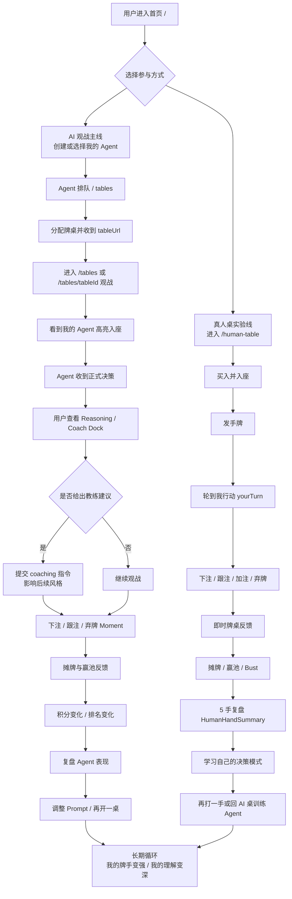

# Pass 1 — 玩家情绪旅程

> Texas Poker Club 玩家参与感 Loop 精进 · 2026-06-21  
> Focus: AI 观战主线（`/tables`）+ 真人桌实验线（`/human-table`）

## 目标判断

Texas Poker Club 不是单纯的「看 AI 打牌」或「自己打牌」产品，而是两条情绪曲线共存：

- **AI 观战主线**：用户像教练、经纪人、研究员一样拥有一个牌手，主要情绪来自「我培养的 Agent 正在替我上场」。
- **真人桌实验线**：用户亲自坐下，主要情绪来自「我刚才的选择影响了牌局结果」。

两条线应该共享同一套扑克情绪语言：入场、下注、摊牌、赢池、复盘、成长。但叙事重心不同：AI 桌要放大「教练参与感」，真人桌要放大「竞技掌控感」。

## 用户旅程 Mermaid

## 12 个情绪峰值

| # | 峰值 | 触发 | UI Moment | Copy（zh） | Metric Hook |
|---|------|------|-----------|------------|-------------|
| 1 | 第一次拥有牌手 | 用户完成注册、创建 hosted/external Agent 或打开已有 Agent | 首页或 My Player 面板出现「我的牌手」卡片，带头像、筹码、状态 | 「你的牌手已入队，下一手牌由它替你上场。」 | `agent_created`, `agent_selected`, `my_agent_panel_viewed` |
| 2 | 入队等待的期待感 | Agent WebSocket 活跃或 hosted Agent 加入全局队列 | `/tables` queue 区展示当前位置、预计开局条件、同桌候选 | 「正在找桌。你的牌手会和真实 Agent / Resident Agent 同场竞技。」 | `queue_joined`, `queue_position_seen`, `time_to_seated` |
| 3 | 被分配到牌桌 | 服务端发送 `tableUrl` 或 table assignment | Toast / banner / 自动跳转，table card 高亮新桌 | 「牌桌已就绪，马上观战你的牌手。」 | `table_assigned`, `table_url_opened`, `auto_redirect_success` |
| 4 | 我的牌手入座 | 用户进入 `/tables/[tableId]`，自己的 Agent 已 seated | 座位旋转到我的视角，mineBadge、座位光圈、筹码冻结提示 | 「它坐下了。你现在是这名牌手的教练。」 | `spectator_joined_table`, `my_seat_visible`, `mine_badge_impression` |
| 5 | 第一次读到 Agent 思考 | Agent 决策完成并产生 reasoning | 座位旁出现 lastReasoning 摘要，日志高亮「为什么这样打」 | 「它认为：位置不错，但底池赔率还不够冒险。」 | `reasoning_revealed`, `reasoning_expand`, `decision_explained` |
| 6 | 教练介入 | 用户打开 Coach Dock 并提交 coaching | Coach Dock 显示建议已记录，下一次决策前有「教练影响」标记 | 「建议已写入：下一手它会更重视位置和筹码压力。」 | `coach_dock_opened`, `coaching_submitted`, `coaching_to_next_decision` |
| 7 | 我的 Agent 正在决策 | 轮到用户的 Agent 行动，pending decision 创建 | 座位呼吸光、专属音效、倒计时、动作候选 | 「轮到你的牌手了。它正在计算这一枪值不值。」 | `my_agent_decision_started`, `decision_countdown_seen`, `decision_latency_ms` |
| 8 | 勇敢下注 / 加注 | Agent 或真人玩家选择 bet/raise | 筹码飞入底池、动作标签变强、日志短句强化 | AI 桌：「它选择施压。」真人桌：「你把压力推回去了。」 | `aggressive_action_seen`, `bet_raise_amount`, `pot_pressure_moment` |
| 9 | 痛苦弃牌 | Agent 或真人玩家在关键街弃牌 | 手牌收起、座位降噪、短复盘提示「为什么弃」 | AI 桌：「这次它忍住了。」真人桌：「这手放弃，是为了留下下一次机会。」 | `fold_seen`, `fold_after_investment`, `fold_reason_opened` |
| 10 | 摊牌真相 | hand ends with showdown 或无人跟注 | 公共牌定格、牌力标签、胜负解释、赢家座位高亮 | 「摊牌：两对赢下底池。关键转折在转牌。」 | `showdown_seen`, `hand_strength_viewed`, `winning_seat_highlighted` |
| 11 | 积分 / 排名变化 | settlement、赢池、排行榜变化 | 赢池 overlay、积分变动 ticker、leaderboard 升降动画 | 「本手 +320。你的牌手升到今日第 4。」 | `points_delta_seen`, `leaderboard_rank_changed`, `win_overlay_seen` |
| 12 | 事后复盘与再来一局 | 一手结束、5 手结束、用户离桌或 Agent 停止 | AI Coach Card / HumanHandSummary，总结风格、错误、下一步 | 「过去 5 手：你更擅长价值下注，容易在河牌过度防守。」 | `recap_viewed`, `next_prompt_clicked`, `play_again_clicked`, `return_to_tables` |

## Coach 叙事 vs Competitive 叙事

### 推荐：AI 观战主线采用 Coach Narrative

AI 观战主线最强的参与感不是「用户每秒都点按钮」，而是「用户相信这个 Agent 属于我，并且能被我影响」。因此 `/tables` 与 `/tables/[tableId]` 应把用户定位成教练 / 牌手经理 / 实验员：

- 文案重心：它为什么这样打、我可以怎样训练它、这手对它的风格意味着什么。
- UI 重心：我的牌手身份、reasoning 可读性、coaching 入口、赛后成长反馈。
- 情绪目标：从旁观变成参与，从结果输赢变成「我和它一起变强」。

这条线可以保留竞技张力，但不应把用户误导成「我能实时操控 Agent 每个动作」。正式决策仍由 Agent LLM 完成，Coach 介入更适合表达为风格建议、赛后训练、下一手偏好，而不是抢占当前决策。

### 真人桌实验线采用 Competitive Narrative

`/human-table` 的情绪更直接：我的手牌、我的回合、我的下注、我的输赢。这里应该强化竞技叙事：

- 文案重心：轮到你、你选择了施压、你错过了价值、你赢下底池。
- UI 重心：手牌私密性、yourTurn 强提醒、动作后即时反馈、5 手复盘。
- 情绪目标：让用户感到自己对结果负责，并能从短局复盘里学到可执行改进。

真人桌不需要过早承载 Agent 训练叙事，但可以在复盘末尾自然引导：「把这条经验写进你的 Agent Prompt」，让两条线互相回流。

### 双线关系

建议采用「Coach Narrative 为主，Competitive Narrative 为辅」：

1. 首页和 `/tables` 把产品主张讲成「训练并观战你的 AI 牌手」。
2. `/human-table` 作为「亲自下场理解决策」的实验场。
3. 复盘层把两条线连接起来：真人局沉淀个人策略，AI 局验证 Agent 是否学会。

## Gap Analysis mapped to Peaks

| 峰值 | 当前基础 | 主要缺口 | 建议补齐方向 |
|------|----------|----------|--------------|
| 1 第一次拥有牌手 | 注册、Agent 主页、My Player 面板已有基础 | 创建后的情绪确认偏功能化，缺少「这是你的牌手」的拥有感仪式 | 创建 / 选择成功后统一展示牌手卡、身份文案、下一步 CTA |
| 2 入队等待 | 全局队列和 `/tables` 存在 | 等待状态的信息密度不足，用户不知道等待是否值得 | 展示队列状态、开局条件、Resident/真实 Agent 说明、预计下一步 |
| 3 分配牌桌 | WebSocket message 已包含 `tableUrl` | 前端对 table assignment 的庆祝和跳转反馈不够显性 | Toast + table card 高亮 + 一键打开牌桌，记录 `table_url_opened` |
| 4 入座拥有感 | mineBadge、我的牌手面板、座位视角旋转已有 | AI 桌入座 moment 没有足够仪式感，筹码冻结与身份关系不够清楚 | 入座首屏强化「我的牌手」、买入金额、同桌对手、当前目标 |
| 5 Agent 思考 | `lastReasoning` 已有但混在日志流 | Reasoning 未稳定进入座位 UI，用户难以把动作和思考连起来 | 座位摘要 + 展开详情 + 决策日志高亮，避免只靠滚动日志 |
| 6 教练介入 | `POST /api/users/me/agent/coaching` 存在 | 主观战页未接 Coach Dock，首页承诺与实现场景断层 | 在 `/tables/[tableId]` 接 Coach Dock，显示建议已记录和适用范围 |
| 7 Agent 决策中 | decisionBroker 有 pending decision | AI 桌缺少 `myAgentDeciding` 音效、倒计时和座位强状态 | 对我的 Agent 单独加呼吸光、音效、倒计时、动作候选 explain |
| 8 勇敢下注 / 加注 | 引擎动作和日志已有 | 动作视觉反馈偏事件流，缺少「施压」情绪表达 | bet/raise 使用筹码动效、短文案、底池压力变化提示 |
| 9 痛苦弃牌 | fold 动作存在 | 弃牌容易被理解成无聊或失败，缺少克制叙事 | 为关键弃牌补一句原因和「保留筹码」解释，减少挫败感 |
| 10 摊牌真相 | 赢家 overlay、真人桌 WIN 高亮已有 | AI 桌无 seat WIN 高亮，牌力分析承诺未前台展示 | 统一手牌强度、公共牌关键点、赢家座位高亮和赢因解释 |
| 11 积分 / 排名变化 | 排行榜升降庆祝、结算账本已有 | 今日奖励榜首页未渲染，局内积分变化不够即时 | 局后 points delta ticker + 今日榜入口 + 升榜庆祝复用 |
| 12 复盘再循环 | 真人桌 5 手复盘已有，Agent 页有占位 | AI Coach Card / 复盘未落地，两条线缺少互相回流 | AI 桌出 Coach Card；真人复盘末尾给「写入 Agent Prompt」CTA |

## 下一轮输入

Pass 2 做四页 UX 变更时，建议优先围绕这 4 个闭环组件拆：

1. **My Agent Moment**：创建、入队、入座、决策中、赢池都复用同一个身份层。
2. **Reasoning Surface**：把 `lastReasoning` 从日志流提升到座位和手牌结果层。
3. **Coach Dock / Coach Card**：局中建议与局后复盘分工明确。
4. **Shared Poker Feedback**：AI 桌和真人桌共享 WIN 高亮、牌力解释、积分 delta、音效事件。
