# Pass 3 — P0-P3 技术任务拆解（gpt-5.3-codex）

> Texas Poker Club 玩家参与感 Loop 精进 · 2026-06-21  
> 目标：把 Pass 0 的产品改进项转换为可排期、可联调、可回归的技术任务清单。

## 0. 范围与约束

- 仅覆盖参与感 Loop 的工程落地，不改动核心牌局规则（`gameEngine` 决策合法性、结算语义保持不变）。
- 以多桌主路径为准：`/tables`、`/tables/[tableId]`；`/table` 仅做兼容。
- 严格遵循生产路由前缀：所有新增前端 fetch / 链接必须走 `withBasePath()` 或 `getBasePath()`。
- 保持 Agent 协议不破坏：WebSocket 正式对局仍由 `/api/agents/ws?agentId=<id>` 驱动，动作 schema 不变。

---

## 1. 架构焦点（本轮最关键链路）

### 1.1 Coaching 到决策注入链路（必保真）

```mermaid
flowchart LR
  U[用户在观战页提交 Coaching] --> A["POST /api/users/me/agent/coaching"]
  A --> B["addRuntimeInstruction(agentId, message, tableId, appliesFromHandId)"]
  B --> C["runtimeInstructions.ts 内存笔记池 notes + version++"]
  C --> D["getRuntimeInstructions(agentId, {tableId, handId})"]
  D --> E["server.ts sendAgentState(decision_task)"]
  E --> F["WebSocket payload.runtimeInstructions[]"]
  F --> G[外部/托管 Agent 组装 LLM Prompt]
  G --> H["action_response + reasoning"]
  H --> I["decisionBroker.validateDecisionResponse"]
  I --> J["gameEngine 执行动作并更新快照"]
```

### 1.2 关键边界文件

- 调度与牌桌生命周期：`src/lib/server/simulator.ts`
- 用户积分冻结/结算：`src/lib/server/userRegistry.ts`
- 运行时指令存取：`src/lib/server/runtimeInstructions.ts`
- 用户 Coaching 入口：`src/app/api/users/me/agent/coaching/route.ts`
- 指令读写 API：`src/app/api/agents/runtime-instructions/route.ts`
- WebSocket 协议下发与动作回执：`server.ts`、`src/lib/server/decisionBroker.ts`

---

## 2. 分阶段任务拆解（P0-P3）

## P0（本 Sprint，直接影响体验）

### P0-T001 观战页接入 Coach Dock 并提交 Coaching

- **目标**：用户在 `tables/[tableId]` 观战页可提交“下一手生效”指导。
- **主文件**
  - `src/app/tables/[tableId]/page.tsx`
  - `src/app/api/users/me/agent/coaching/route.ts`
  - 可复用组件建议：`src/components/*`（新增 Coach Dock）
- **API 边界**
  - `POST /api/users/me/agent/coaching`
  - 请求：`{ tableId: string, message: string }`
  - 响应关键字段：`ok`, `appliesFromHandId`, `note`, `runtimeInstructions`
- **Schema 边界**
  - `message` 最终经 `runtimeInstructions.normalizeMessage()` 归一化（trim、压缩空白、最大 500 字符）。
  - 指令作用域包含 `tableId` + `appliesFromHandId`，必须保持“从下一手生效”语义。
- **风险**
  - **WebSocket 协议联动风险**：用户以为“立即生效”，但实际在下个 `decision_task` 才注入。
  - **移动端风险**：Coach Dock 占据底部空间，可能与 BottomNav / 观战操作冲突。
  - **basePath 风险**：若 fetch 未使用 `withBasePath()`，生产 `/aipokerclub` 下会 404。
- **验收**
  - 提交后 UI 明确提示“第 N 手起生效”；
  - 下一次 `decision_task` 的 `runtimeInstructions` 包含该 Coaching。

### P0-T002 座位态展示 `lastReasoning` + 日志高亮

- **目标**：把“我家 Agent 在想什么”从日志噪音升级为可感知状态。
- **主文件**
  - `src/app/tables/[tableId]/page.tsx`
  - 可能涉及：座位组件与日志组件文件（`src/components/*`）
- **数据边界**
  - 来自 `GameSnapshot.players[].lastReasoning`（定义见 `src/lib/poker/types.ts`）。
- **风险**
  - 文本长度与频率造成移动端渲染抖动；
  - 多语言/emoji 截断导致布局破坏。
- **验收**
  - 我方 Agent reasoning 在座位区与日志区均有统一视觉锚点；
  - SSE 高频刷新下不出现明显掉帧。

### P0-T003 首页补齐 Live 预览 + 今日奖励榜 + 实验积分榜

- **目标**：把首页承诺内容从文案变成可见数据模块。
- **主文件**
  - `src/app/page.tsx`
  - `src/app/api/tables/route.ts`
  - `src/app/api/leaderboard/route.ts`
- **API 边界**
  - `GET /api/tables`
  - `GET /api/leaderboard?limit=...`
- **风险**
  - 首页并发请求增多，首屏性能恶化；
  - basePath 漏加导致生产环境数据区全部空白。
- **验收**
  - 模块在登录/未登录均可稳定渲染；
  - 所有请求路径在本地与 `/aipokerclub` 子路径均可命中。

### P0-T004 AI 桌补齐 `winningSeat` 反馈与 `myAgentDeciding` 音效

- **目标**：对齐真人桌已有情绪反馈，缩小两线体验割裂。
- **主文件**
  - `src/app/tables/[tableId]/page.tsx`
  - `src/lib/sound/*`（如 `audioManager.ts`、`tableSoundEvents.ts`）
- **事件边界**
  - 依据快照 / actionHistory 推断赢家座位和“我方决策中”状态。
- **风险**
  - 音效触发抖动（重复播放）；
  - iOS Safari 自动播放策略导致首触发失效。
- **验收**
  - 每手只触发一次中奖反馈；
  - 我方决策开始/结束音效状态转换正确。

---

## P1（稳定层：协议可观测、体验一致性）

### P1-T101 Runtime Instructions 可观测性增强

- **目标**：能定位“为什么这手没按 coaching 行动”。
- **主文件**
  - `src/lib/server/runtimeInstructions.ts`
  - `server.ts`
  - `src/app/api/agents/runtime-instructions/route.ts`
- **改造边界**
  - 增加只读调试字段（例如命中 note IDs / 生效窗口），不破坏既有 `instructions[]`。
  - 仅新增可选字段，保持向后兼容。
- **风险（Agent WebSocket 协议）**
  - 若改动 `decision_task` 必填结构会破坏外部 Agent。
- **验收**
  - 老 Agent 不改代码也能继续跑；
  - 新调试字段能解释 note 可见性判定。

### P1-T102 协议文档与模板同步（避免“文档过时”）

- **目标**：协议演进时，`/api/agents/client-template` 与技能文档同步。
- **主文件**
  - `src/app/api/agents/client-template/route.ts`
  - `.cursor/skills/texas-poker-agent/SKILL.md`
  - `PROJECT_CONTEXT.md`
- **边界**
  - 强调 `tableUrl` 在 `table_assigned/decision_task` 的必传与转发责任。
  - 明确动作 schema：`fold/check/call` 不带 `amount`。
- **风险**
  - 文档不一致引发第三方 Agent 错误实现。
- **验收**
  - 模板日志与文档示例字段保持一一对应。

### P1-T103 多端体验一致性（桌面/移动）

- **目标**：核心 CTA 在移动端不被遮挡，观战信息层级稳定。
- **主文件**
  - `src/app/tables/[tableId]/page.tsx`
  - `src/components/BottomNav.tsx`
  - `src/app/page.tsx`
- **风险（mobile）**
  - 键盘弹起后输入区错位；
  - 底部安全区处理不一致导致按钮被 Home Indicator 遮挡。
- **验收**
  - iPhone 常见视口下完成“提交 coaching + 查看回执 + 继续观战”闭环。

---

## P2（扩展层：运营化与策略化）

### P2-T201 Coaching 模板化与策略标签

- **目标**：把自由文本 coaching 升级为“模板 + 参数”降低认知负担。
- **主文件**
  - 前端 Coach Dock 组件（新）
  - `src/app/api/users/me/agent/coaching/route.ts`
  - `src/lib/server/runtimeInstructions.ts`
- **Schema 边界**
  - 外部接口仍提交 `message`（保证兼容）；
  - 可在前端内维护模板元数据，不强制后端 schema 破坏式升级。
- **风险**
  - 模板与实际策略语义不一致，反而增加误导。
- **验收**
  - 模板一键插入后，生成 message 可读且可追溯。

### P2-T202 参与感埋点与回放指标

- **目标**：将“参与感”转成可追踪指标（提交率、命中率、复访率）。
- **主文件**
  - 前端页面埋点位置（`src/app/page.tsx`、`src/app/tables/[tableId]/page.tsx`）
  - 服务端日志聚合入口（`src/lib/server/logger.ts` 相关调用点）
- **边界**
  - 不记录敏感 token，不记录私牌。
- **风险**
  - 埋点噪音过高影响可读性与成本。
- **验收**
  - 可按 `ownerUserId + tableId + handId` 串联关键行为。

### P2-T203 首页个性化入口（我的牌手动态）

- **目标**：首页直接回到“我与我的牌手”的实时状态。
- **主文件**
  - `src/app/page.tsx`
  - `src/app/api/users/me/agent/route.ts`
- **风险**
  - 未登录态与已登录态状态机复杂化。
- **验收**
  - 登录用户可一跳进入当前 table URL 或最近战绩。

---

## P3（治理层：长期稳定与回归体系）

### P3-T301 协议回归测试（WebSocket + 动作校验）

- **目标**：防止协议微调导致外部 Agent 大面积断连或拒单。
- **主文件**
  - `server.ts`
  - `src/lib/server/decisionBroker.ts`
  - `src/app/api/agents/client-template/route.ts`
- **测试边界**
  - 覆盖 `action_response` 的合法/非法样例；
  - 覆盖 `table_assigned`、`decision_task` 的 `tableUrl` 存在性；
  - 覆盖 stale request 与 recoverable error。
- **风险（Agent WebSocket 协议）**
  - 变更消息字段顺序/可空性引发弱类型客户端崩溃。
- **验收**
  - 回归脚本能在 CI 发现协议破坏性变更。

### P3-T302 basePath 合规扫描与守护

- **目标**：杜绝新增硬编码 `/api/...`、`/tables/...` 导致生产子路径失效。
- **主文件**
  - `src/lib/client/basePath.ts`
  - 全前端页面与组件（规则扫描）
  - `next.config.ts`
- **边界**
  - 新增 lint/脚本规则：客户端网络请求必须经 `withBasePath()`。
- **风险（basePath）**
  - 开发环境可用、生产不可用的“假阳性通过”。
- **验收**
  - 本地 `NEXT_PUBLIC_BASE_PATH=/aipokerclub npm run dev` 冒烟通过。

### P3-T303 虚拟 Bot 风险隔离与可解释化

- **目标**：保持虚拟 Bot 仅作流动性补位，不干扰真实用户积分与策略判断。
- **主文件**
  - `src/lib/server/simulator.ts`
  - `src/lib/server/virtualAgents.ts`
  - `src/lib/server/userRegistry.ts`
- **边界**
  - 强化 `kind === "virtual"` 路径与真实结算路径隔离；
  - 输出可观测日志（何时补位、何时释放）。
- **风险（virtual bots）**
  - 错误结算穿透到真实用户积分；
  - 虚拟 Bot 过量补位稀释“真实对局”体感。
- **验收**
  - 任何 `virtual` 玩家不触发 `reserveGameBuyIns/settleGameBuyIns`；
  - 仅在规则允许时补位（有真实用户 Agent、且人数阈值满足）。

---

## 3. API / Schema 边界总表（实施时必须守住）

- **动作 schema（硬约束）**
  - `fold/check/call`：只能是 `{"type":"fold|check|call"}`，不得带 `amount`
  - `bet/raise`：必须带正数 `amount`
  - 参考：`src/lib/poker/types.ts`、`src/lib/server/decisionBroker.ts`
- **决策响应结构**
  - `type = "action_response"`、`playerId` 非空、`reasoning` 非空（中文要求在服务端校验文案中已约束）
- **Runtime Instructions 可见性**
  - 由 `tableId` + `appliesFromHandId` + 当前 `handId` 决定
  - 参考：`isInstructionVisible()`（`src/lib/server/runtimeInstructions.ts`）
- **Coaching 生效语义**
  - `POST /api/users/me/agent/coaching` 默认写入“下一手生效”
  - 参考：`appliesFromHandId = currentHand + 1`
- **tableUrl 传播**
  - 在 `table_assigned` / `decision_task` 携带，用于用户移动端观战
  - 参考：`server.ts` `sendAssignmentState()` / `sendAgentState()`

---

## 4. 风险矩阵（聚焦四类高优先风险）

| 风险类别 | 触发点 | 后果 | 缓解措施 |
|---|---|---|---|
| Agent WebSocket 协议 | `decision_task` 字段变更、动作校验更严 | 外部 Agent 断连/拒单 | 仅增量可选字段；模板与文档同步；协议回归测试 |
| basePath | 新增 fetch/跳转硬编码根路径 | 生产 `/aipokerclub` 下页面空白或 404 | 统一 `withBasePath()`；P3 合规扫描；子路径冒烟 |
| mobile | Coach Dock + BottomNav + 键盘叠加 | 输入与 CTA 被遮挡，转化下降 | 移动端专门布局断点与安全区测试 |
| virtual bots | 虚拟 Bot 参与结算或过度补位 | 积分错误/真实对局感下降 | 严格 `kind=virtual` 隔离与补位阈值控制，日志可观测 |

---

## 5. 建议实施顺序（工程排期）

1. **先 P0-T001 + P0-T002**：先形成“我能干预 + 我看得见反馈”的最短闭环。  
2. **再 P0-T004 + P0-T003**：补齐情绪峰值与首页入口，拉高首次体验。  
3. **进入 P1-T101/T102**：把链路可观测和文档同步补上，降低后续返工。  
4. **P2/P3 按容量滚动推进**：优先协议回归与 basePath 守护，再做模板化与指标化。  

---

## 6. DoD（Definition of Done）

- 功能完成：P0 各任务可独立演示、串联演示均通过。
- 协议稳定：外部 Agent 样例（client-template）可持续连接、收包、回包。
- 子路径可用：`/aipokerclub` 下关键页面与 API 全部可访问。
- 移动可用：iPhone 常见视口完成“观战 + coaching + 继续观看”闭环。
- 数据安全：无 token 泄漏、虚拟 Bot 不影响真实用户积分。
