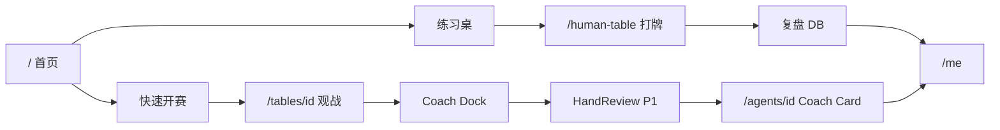

# Loop 维护轮 #10/30

> 2026-06-21 · Tick #10 · 两线用户旅程对照

## AI 观战 vs 真人练习 · 切换场景

| 场景 | AI 线 (`/tables`) | 真人线 (`/human-table`) | 统一目标 |
|------|-------------------|-------------------------|----------|
| 首次进入 | 首页快速开赛 → 观战 | `/me` 或 BottomNav「练习」 | 3 分钟内看到牌桌 |
| 身份 | 教练 / 实验员 | 场上玩家 | 都是「实验积分」叙事 |
| 决策 | AI + Coaching | 自己点击 + yourTurn 音 | 每手有「动作反馈」 |
| 赛后 | HandReviewList（P1） | 已有 5 手 DB 复盘 | 同一 `HandReviewList` 组件 |
| 峰值音 | myAgentDeciding | yourTurn | `SoundProfile` 统一 |
| 社交 | Reaction 条（P2） | 邀请链接 | 轻互动，非 chat |
| 积分 | Agent 冻结/结算 | 同 userRegistry | 共用排行榜 |

## 跨线 METRICS

- `human_ai_cross_use`：7 日内访问 `/tables/*` 且 `/human-table` 的登录用户比
- 预期 BottomNav 练习入口（P2）提升该比例

## 文案一致（跨线）

| 避免 | 统一为 |
|------|--------|
| 「下注」「赢钱」 | 「训练」「实验积分」 |
| 「观众」 alone | 「观战模式 / 教练在场」 |

## Tick #10 结论

两线**组件级统一**路径已清晰；下一优先仍是 **PR-1**（AI 线复盘追平真人线）。

## Tick #11+ 建议

- 停止纯文档 Loop（设计+对照已足） **或**
- 用户确认 → **开始 PR-1 实现**
